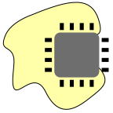
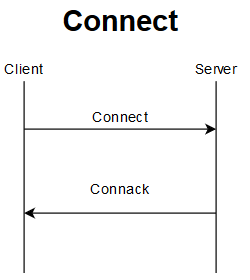
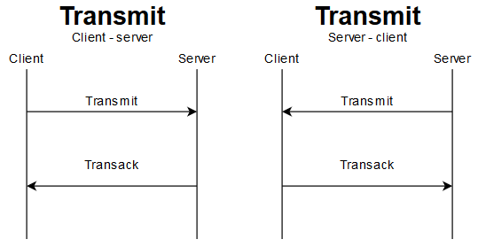
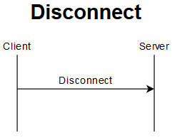

<body class="c49">

ULEP Ultra Lightweight Embedded Protocol

<ol class="c14 lst-kix_zcfjg5bmbfyj-0 start" start="1">
<li class="c29"><h1 id="h.npfil513vz5f" style="display:inline">
Protocol purpose</h1></li></ol>

Protocol was created to provide a transport layer for applications running over limited bandwidth or data transfer cost expensive link, e.g. satellite connection.

<ol class="c14 lst-kix_zcfjg5bmbfyj-0" start="2"><li class="c29"><h1 id="h.g4e7qbz9nt4o" style="display:inline">
System architecture</h1></li></ol>

System basis on large, but limited number of active clients, which connect to the base server using TCP/IP protocol. Every message has a header which contains message data type and some type specific data.

<ol class="c14 lst-kix_zcfjg5bmbfyj-0" start="3">
<li class="c29"><h1 id="h.5tcx84k3gh93" style="display:inline">Workflow
</h1></li></ol>

Client connects to a known server application using CONNECT message:

Chart 3.1 Connect workflow

After successful connection data transmission can begin in both directions:

Chart 3.2 Data transmission workflow

When a client decides to close the connection, it has to send a disconnect message. After receiving this message, there should be no further data flow:

Chart 3.3 Disconnect workflow
<ol class="c14 lst-kix_zcfjg5bmbfyj-0" start="4"><li class="c29"><h1 id="h.s9im23xgmo46" style="display:inline">Messages description</h1></li></ol>
To

<ol class="c14 lst-kix_zcfjg5bmbfyj-1 start" start="1"><li class="c33"><h2 id="h.7xvwwneiwmy3" style="display:inline">Messages types and format</h2></li></ol>
All messages starts with header byte which has format shown in table 4.1.1:

<table class="c17"><tbody><tr class="c31"><td class="c45" colspan="1" rowspan="1">
Bit number
</td><td class="c23" colspan="1" rowspan="1">
7
</td><td class="c23" colspan="1" rowspan="1">
6
</td><td class="c23" colspan="1" rowspan="1">
5
</td><td class="c23" colspan="1" rowspan="1">
4
</td><td class="c23" colspan="1" rowspan="1">
3
</td><td class="c23" colspan="1" rowspan="1">
2
</td><td class="c23" colspan="1" rowspan="1">
1
</td><td class="c23" colspan="1" rowspan="1">
0
</td></tr><tr class="c7"><td class="c45" colspan="1" rowspan="1">
Description
</td><td class="c47" colspan="2" rowspan="1">
Type
</td><td class="c50" colspan="6" rowspan="1">
Type specific usage
</td></tr></tbody></table>
Table 4.1.1Header byte format

All messages have type value present in bits 7 and 6 in byte 1. These types are described in Table 4.1.2.

<table class="c17"><tbody><tr class="c31"><td class="c0" colspan="1" rowspan="1">
Type
</td><td class="c13" colspan="1" rowspan="1">
Value
</td><td class="c22" colspan="1" rowspan="1">
Description
</td></tr><tr class="c31"><td class="c0" colspan="1" rowspan="1">
CONNECT/CONNACK
</td><td class="c13" colspan="1" rowspan="1">
0x00
</td><td class="c22" colspan="1" rowspan="1">
Message sent while connecting and acknowledging connection
</td></tr><tr class="c31"><td class="c0" colspan="1" rowspan="1">
TRANSMIT
</td><td class="c13" colspan="1" rowspan="1">
0x40
</td><td class="c22" colspan="1" rowspan="1">
Message sent from client to server and from server to client
</td></tr><tr class="c31"><td class="c0" colspan="1" rowspan="1">
TRANSACK
</td><td class="c13" colspan="1" rowspan="1">
0x80
</td><td class="c22" colspan="1" rowspan="1">
Acknowledge message just after receiving message
</td></tr><tr class="c31"><td class="c0" colspan="1" rowspan="1">
DISCONNECT
</td><td class="c13" colspan="1" rowspan="1">
0xC0
</td><td class="c22" colspan="1" rowspan="1">
Message sent while client disconnects
</td></tr></tbody></table>
Table 4.1.2 Message types
<ol class="c14 lst-kix_zcfjg5bmbfyj-1" start="2"><li class="c33"><h2 id="h.fa3mmb1jc5rh" style="display:inline">Connect/Connack</h2></li></ol>
Client is the side, which initializes connection. Client sends a fixed length message of connect type and waits for a response from the server with a connack message. Connack has a fixed length of 1 byte. Connect and connack messages are the same type.
<ol class="c14 lst-kix_zcfjg5bmbfyj-2 start" start="1"><li class="c46"><h3 id="h.bek15zpfncs5" style="display:inline">Connect</h3></li></ol>
Connect message is 22 byte long message, which should be sent by client during first communication. It contains 4 information in proper bit configuration described in table 4.2.1.1. Those values are:
<ul class="c14 lst-kix_nwhxze760d6z-0 start"><li class="c27 c43">Type - 2 bits defining message type</li><li class="c27 c43">Keep alive - 6 bits value of levels of keep alive time (predefined in whole system)</li><li class="c27 c43">Client ID - client individual identifier defined in 4 byte space (unsigned 32 bit integer)</li><li class="c27 c43">Server API key for authorization - value which has to be equal to predefined value stored in server application.</li></ul>

<table class="c17"><tbody><tr class="c7"><td class="c18" colspan="9" rowspan="1">
Byte 1
</td></tr><tr class="c7"><td class="c16" colspan="1" rowspan="1">
Bit number
</td><td class="c6" colspan="1" rowspan="1">
7
</td><td class="c6" colspan="1" rowspan="1">
6
</td><td class="c6" colspan="1" rowspan="1">
5
</td><td class="c6" colspan="1" rowspan="1">
4
</td><td class="c6" colspan="1" rowspan="1">
3
</td><td class="c6" colspan="1" rowspan="1">
2
</td><td class="c6" colspan="1" rowspan="1">
1
</td><td class="c6" colspan="1" rowspan="1">
0
</td></tr><tr class="c31"><td class="c16" colspan="1" rowspan="1">
Description
</td><td class="c20" colspan="2" rowspan="1">
Type (0x40)
</td><td class="c25" colspan="6" rowspan="1">
Keep alive
</td></tr><tr class="c7"><td class="c16" colspan="1" rowspan="1">
Values
</td><td class="c6" colspan="1" rowspan="1">
0
</td><td class="c6" colspan="1" rowspan="1">
0
</td><td class="c6" colspan="1" rowspan="1">
X
</td><td class="c6" colspan="1" rowspan="1">
X
</td><td class="c6" colspan="1" rowspan="1">
X
</td><td class="c6" colspan="1" rowspan="1">
X
</td><td class="c6" colspan="1" rowspan="1">
X
</td><td class="c6" colspan="1" rowspan="1">
X
</td></tr><tr class="c7"><td class="c18" colspan="9" rowspan="1">
Byte 2-6 (default)
</td></tr><tr class="c31"><td class="c16" colspan="1" rowspan="1">
Bit number
</td><td class="c6" colspan="1" rowspan="1">
7
</td><td class="c6" colspan="1" rowspan="1">
6
</td><td class="c6" colspan="1" rowspan="1">
5
</td><td class="c6" colspan="1" rowspan="1">
4
</td><td class="c6" colspan="1" rowspan="1">
3
</td><td class="c6" colspan="1" rowspan="1">
2
</td><td class="c6" colspan="1" rowspan="1">
1
</td><td class="c6" colspan="1" rowspan="1">
0
</td></tr><tr class="c31"><td class="c16" colspan="1" rowspan="1">
Description
</td><td class="c24" colspan="8" rowspan="1">
Client ID
</td></tr><tr class="c31"><td class="c16" colspan="1" rowspan="1">
Values
</td><td class="c6" colspan="1" rowspan="1">
X
</td><td class="c6" colspan="1" rowspan="1">
X
</td><td class="c6" colspan="1" rowspan="1">
X
</td><td class="c6" colspan="1" rowspan="1">
X
</td><td class="c6" colspan="1" rowspan="1">
X
</td><td class="c6" colspan="1" rowspan="1">
X
</td><td class="c6" colspan="1" rowspan="1">
X
</td><td class="c6" colspan="1" rowspan="1">
X
</td></tr><tr class="c7"><td class="c18" colspan="9" rowspan="1">
Byte 7-22 (default)
</td></tr><tr class="c31"><td class="c16" colspan="1" rowspan="1">
Bit number
</td><td class="c6" colspan="1" rowspan="1">
7
</td><td class="c6" colspan="1" rowspan="1">
6
</td><td class="c6" colspan="1" rowspan="1">
5
</td><td class="c6" colspan="1" rowspan="1">
4
</td><td class="c6" colspan="1" rowspan="1">
3
</td><td class="c6" colspan="1" rowspan="1">
2
</td><td class="c6" colspan="1" rowspan="1">
1
</td><td class="c6" colspan="1" rowspan="1">
0
</td></tr><tr class="c31"><td class="c16" colspan="1" rowspan="1">
Description
</td><td class="c24" colspan="8" rowspan="1">
API Key
</td></tr><tr class="c31"><td class="c16" colspan="1" rowspan="1">
Values
</td><td class="c6" colspan="1" rowspan="1">
X
</td><td class="c6" colspan="1" rowspan="1">
X
</td><td class="c6" colspan="1" rowspan="1">
X
</td><td class="c6" colspan="1" rowspan="1">
X
</td><td class="c6" colspan="1" rowspan="1">
X
</td><td class="c6" colspan="1" rowspan="1">
X
</td><td class="c6" colspan="1" rowspan="1">
X
</td><td class="c6" colspan="1" rowspan="1">
X
</td></tr></tbody></table>
Table 4.2.1.1

<ol class="c14 lst-kix_zcfjg5bmbfyj-2" start="2"><li class="c46"><h3 id="h.md8lk04dgl7y" style="display:inline">Connack</h3></li></ol>
Connack message is 1 byte long and contains 2 fields:
<ul class="c14 lst-kix_h53mbln3tte5-0 start"><li class="c27 c43">Type - as in connect message (0x00)</li><li class="c27 c43">Return code - feedback value from server which determine if connection is successful or there is some issue with connection.</li></ul>
Format of connack message is described in table 4.2.2.1

<table class="c17"><tbody><tr class="c7"><td class="c18" colspan="9" rowspan="1">
Byte 1
</td></tr><tr class="c7"><td class="c16" colspan="1" rowspan="1">
Bit number
</td><td class="c6" colspan="1" rowspan="1">
7
</td><td class="c6" colspan="1" rowspan="1">
6
</td><td class="c6" colspan="1" rowspan="1">
5
</td><td class="c6" colspan="1" rowspan="1">
4
</td><td class="c6" colspan="1" rowspan="1">
3
</td><td class="c6" colspan="1" rowspan="1">
2
</td><td class="c6" colspan="1" rowspan="1">
1
</td><td class="c6" colspan="1" rowspan="1">
0
</td></tr><tr class="c31"><td class="c16" colspan="1" rowspan="1">
Description
</td><td class="c20" colspan="2" rowspan="1">
Type (0x00)
</td><td class="c25" colspan="6" rowspan="1">
Return code
</td></tr><tr class="c7"><td class="c16" colspan="1" rowspan="1">
Values
</td><td class="c6" colspan="1" rowspan="1">
0
</td><td class="c6" colspan="1" rowspan="1">
0
</td><td class="c6" colspan="1" rowspan="1">
X
</td><td class="c6" colspan="1" rowspan="1">
X
</td><td class="c6" colspan="1" rowspan="1">
X
</td><td class="c6" colspan="1" rowspan="1">
X
</td><td class="c6" colspan="1" rowspan="1">
X
</td><td class="c6" colspan="1" rowspan="1">
X
</td></tr></tbody></table>
Table 4.2.2.1

Return codes are described in table 4.2.1.2

<table class="c17"><tbody><tr class="c31"><td class="c6" colspan="1" rowspan="1">
Value
</td><td class="c19" colspan="1" rowspan="1">
Name
</td><td class="c34" colspan="1" rowspan="1">
Description
</td></tr><tr class="c31"><td class="c6" colspan="1" rowspan="1">
0x00
</td><td class="c19" colspan="1" rowspan="1">
OK
</td><td class="c34" colspan="1" rowspan="1">
Connection successful 
</td></tr><tr class="c31"><td class="c6" colspan="1" rowspan="1">
0x01
</td><td class="c19" colspan="1" rowspan="1">
API_KEY
</td><td class="c34" colspan="1" rowspan="1">
Authorization failed - wrong API key
</td></tr><tr class="c31"><td class="c6" colspan="1" rowspan="1">
0x02
</td><td class="c19" colspan="1" rowspan="1">
ID_PROHIBITED
</td><td class="c34" colspan="1" rowspan="1">
Wrong client ID value - server doesn&rsquo;t allow it to authenticate
</td></tr><tr class="c31"><td class="c6" colspan="1" rowspan="1">
0x03
</td><td class="c19" colspan="1" rowspan="1">
NOK
</td><td class="c34" colspan="1" rowspan="1">
Unknown (other) issue
</td></tr></tbody></table>
Table 4.2.1.2
<ol class="c14 lst-kix_zcfjg5bmbfyj-1" start="3"><li class="c33"><h2 id="h.sntn0rk6epw7" style="display:inline">Transmit</h2></li></ol>
Transmit message contains 3 bytes header followed by defined data bytes containing message.
<table class="c17"><tbody><tr class="c35"><td class="c18" colspan="9" rowspan="1">
Byte 1
</td></tr><tr class="c35"><td class="c16" colspan="1" rowspan="1">
Bit number
</td><td class="c6" colspan="1" rowspan="1">
7
</td><td class="c6" colspan="1" rowspan="1">
6
</td><td class="c6" colspan="1" rowspan="1">
5
</td><td class="c6" colspan="1" rowspan="1">
4
</td><td class="c6" colspan="1" rowspan="1">
3
</td><td class="c6" colspan="1" rowspan="1">
2
</td><td class="c6" colspan="1" rowspan="1">
1
</td><td class="c6" colspan="1" rowspan="1">
0
</td></tr><tr class="c35"><td class="c16" colspan="1" rowspan="1">
Description
</td><td class="c20" colspan="2" rowspan="1">
Type (0x40)
</td><td class="c25" colspan="6" rowspan="1">
Topic identifier
</td></tr><tr class="c35"><td class="c16" colspan="1" rowspan="1">
Values
</td><td class="c6" colspan="1" rowspan="1">
0
</td><td class="c6" colspan="1" rowspan="1">
1
</td><td class="c6" colspan="1" rowspan="1">
X
</td><td class="c6" colspan="1" rowspan="1">
X
</td><td class="c6" colspan="1" rowspan="1">
X
</td><td class="c6" colspan="1" rowspan="1">
X
</td><td class="c6" colspan="1" rowspan="1">
X
</td><td class="c6" colspan="1" rowspan="1">
X
</td></tr><tr class="c35"><td class="c18" colspan="9" rowspan="1">
Byte 2
</td></tr><tr class="c35"><td class="c16" colspan="1" rowspan="1">
Bit number
</td><td class="c6" colspan="1" rowspan="1">
7
</td><td class="c6" colspan="1" rowspan="1">
6
</td><td class="c6" colspan="1" rowspan="1">
5
</td><td class="c6" colspan="1" rowspan="1">
4
</td><td class="c6" colspan="1" rowspan="1">
3
</td><td class="c6" colspan="1" rowspan="1">
2
</td><td class="c6" colspan="1" rowspan="1">
1
</td><td class="c6" colspan="1" rowspan="1">
0
</td></tr><tr class="c35"><td class="c16" colspan="1" rowspan="1">
Description
</td><td class="c24" colspan="8" rowspan="1">
Message ID
</td></tr><tr class="c35"><td class="c16" colspan="1" rowspan="1">
Values
</td><td class="c6" colspan="1" rowspan="1">
X
</td><td class="c6" colspan="1" rowspan="1">
X
</td><td class="c6" colspan="1" rowspan="1">
X
</td><td class="c6" colspan="1" rowspan="1">
X
</td><td class="c6" colspan="1" rowspan="1">
X
</td><td class="c6" colspan="1" rowspan="1">
X
</td><td class="c6" colspan="1" rowspan="1">
X
</td><td class="c6" colspan="1" rowspan="1">
X
</td></tr><tr class="c35"><td class="c18" colspan="9" rowspan="1">
Byte 3
</td></tr><tr class="c35"><td class="c16" colspan="1" rowspan="1">
Bit number
</td><td class="c6" colspan="1" rowspan="1">
7
</td><td class="c6" colspan="1" rowspan="1">
6
</td><td class="c6" colspan="1" rowspan="1">
5
</td><td class="c6" colspan="1" rowspan="1">
4
</td><td class="c6" colspan="1" rowspan="1">
3
</td><td class="c6" colspan="1" rowspan="1">
2
</td><td class="c6" colspan="1" rowspan="1">
1
</td><td class="c6" colspan="1" rowspan="1">
0
</td></tr><tr class="c35"><td class="c16" colspan="1" rowspan="1">
Description
</td><td class="c24" colspan="8" rowspan="1">
Message length
</td></tr><tr class="c35"><td class="c16" colspan="1" rowspan="1">
Values
</td><td class="c6" colspan="1" rowspan="1">
X
</td><td class="c6" colspan="1" rowspan="1">
X
</td><td class="c6" colspan="1" rowspan="1">
X
</td><td class="c6" colspan="1" rowspan="1">
X
</td><td class="c6" colspan="1" rowspan="1">
X
</td><td class="c6" colspan="1" rowspan="1">
X
</td><td class="c6" colspan="1" rowspan="1">
X
</td><td class="c6" colspan="1" rowspan="1">
X
</td></tr><tr class="c35"><td class="c18" colspan="9" rowspan="1">
Byte 4+ (optional)
</td></tr><tr class="c35"><td class="c16" colspan="1" rowspan="1">
Bit number
</td><td class="c6" colspan="1" rowspan="1">
7
</td><td class="c6" colspan="1" rowspan="1">
6
</td><td class="c6" colspan="1" rowspan="1">
5
</td><td class="c6" colspan="1" rowspan="1">
4
</td><td class="c6" colspan="1" rowspan="1">
3
</td><td class="c6" colspan="1" rowspan="1">
2
</td><td class="c6" colspan="1" rowspan="1">
1
</td><td class="c6" colspan="1" rowspan="1">
0
</td></tr><tr class="c35"><td class="c16" colspan="1" rowspan="1">
Description
</td><td class="c24" colspan="8" rowspan="1">
User data
</td></tr><tr class="c35"><td class="c16" colspan="1" rowspan="1">
Values
</td><td class="c6" colspan="1" rowspan="1">
X
</td><td class="c6" colspan="1" rowspan="1">
X
</td><td class="c6" colspan="1" rowspan="1">
X
</td><td class="c6" colspan="1" rowspan="1">
X
</td><td class="c6" colspan="1" rowspan="1">
X
</td><td class="c6" colspan="1" rowspan="1">
X
</td><td class="c6" colspan="1" rowspan="1">
X
</td><td class="c6" colspan="1" rowspan="1">
X
</td></tr></tbody></table><ol class="c14 lst-kix_zcfjg5bmbfyj-1" start="4"><li class="c33"><h2 id="h.bgsh6iv8qjb7" style="display:inline">Transack</h2></li></ol>
Transack message has a fixed length of 2 bytes and its content should be equal to the first 2 bytes of the transmit message which it is acknowledging except of the message type. Message should point to received message by its topic identifier and message ID. Description of message is presented in table 4.4.1.

<table class="c17"><tbody><tr class="c7"><td class="c18" colspan="9" rowspan="1">
Byte 1
</td></tr><tr class="c7"><td class="c16" colspan="1" rowspan="1">
Bit number
</td><td class="c6" colspan="1" rowspan="1">
7
</td><td class="c6" colspan="1" rowspan="1">
6
</td><td class="c6" colspan="1" rowspan="1">
5
</td><td class="c6" colspan="1" rowspan="1">
4
</td><td class="c6" colspan="1" rowspan="1">
3
</td><td class="c6" colspan="1" rowspan="1">
2
</td><td class="c6" colspan="1" rowspan="1">
1
</td><td class="c6" colspan="1" rowspan="1">
0
</td></tr><tr class="c31"><td class="c16" colspan="1" rowspan="1">
Description
</td><td class="c20" colspan="2" rowspan="1">
Type (0x80)
</td><td class="c25" colspan="6" rowspan="1">
Topic identifier
</td></tr><tr class="c7"><td class="c16" colspan="1" rowspan="1">
Values
</td><td class="c6" colspan="1" rowspan="1">
1
</td><td class="c6" colspan="1" rowspan="1">
0
</td><td class="c6" colspan="1" rowspan="1">
X
</td><td class="c6" colspan="1" rowspan="1">
X
</td><td class="c6" colspan="1" rowspan="1">
X
</td><td class="c6" colspan="1" rowspan="1">
X
</td><td class="c6" colspan="1" rowspan="1">
X
</td><td class="c6" colspan="1" rowspan="1">
X
</td></tr><tr class="c7"><td class="c18" colspan="9" rowspan="1">
Byte 2
</td></tr><tr class="c31"><td class="c16" colspan="1" rowspan="1">
Bit number
</td><td class="c6" colspan="1" rowspan="1">
7
</td><td class="c6" colspan="1" rowspan="1">
6
</td><td class="c6" colspan="1" rowspan="1">
5
</td><td class="c6" colspan="1" rowspan="1">
4
</td><td class="c6" colspan="1" rowspan="1">
3
</td><td class="c6" colspan="1" rowspan="1">
2
</td><td class="c6" colspan="1" rowspan="1">
1
</td><td class="c6" colspan="1" rowspan="1">
0
</td></tr><tr class="c31"><td class="c16" colspan="1" rowspan="1">
Description
</td><td class="c24" colspan="8" rowspan="1">
Message ID
</td></tr></tbody></table>
Table 4.4.1
<ol class="c14 lst-kix_zcfjg5bmbfyj-1" start="5"><li class="c33"><h2 id="h.g9szj2m825ii" style="display:inline">Disconnect</h2></li></ol>
Disconnect message is fixed length of 1 byte and can be sent from client and server side. It contains only type value, presented in table 4.5.1. When this message is transmitted or received, both sides should close the connection.

<table class="c17"><tbody><tr class="c7"><td class="c18" colspan="9" rowspan="1">
Byte 1
</td></tr><tr class="c7"><td class="c16" colspan="1" rowspan="1">
Bit number
</td><td class="c6" colspan="1" rowspan="1">
7
</td><td class="c6" colspan="1" rowspan="1">
6
</td><td class="c6" colspan="1" rowspan="1">
5
</td><td class="c6" colspan="1" rowspan="1">
4
</td><td class="c6" colspan="1" rowspan="1">
3
</td><td class="c6" colspan="1" rowspan="1">
2
</td><td class="c6" colspan="1" rowspan="1">
1
</td><td class="c6" colspan="1" rowspan="1">
0
</td></tr><tr class="c31"><td class="c16" colspan="1" rowspan="1">
Description
</td><td class="c20" colspan="2" rowspan="1">
Type (0xC0)
</td><td class="c25" colspan="6" rowspan="1">
Reserved
</td></tr><tr class="c7"><td class="c16" colspan="1" rowspan="1">
Values
</td><td class="c6" colspan="1" rowspan="1">
1
</td><td class="c6" colspan="1" rowspan="1">
1
</td><td class="c6" colspan="1" rowspan="1">
0
</td><td class="c6" colspan="1" rowspan="1">
0
</td><td class="c6" colspan="1" rowspan="1">
0
</td><td class="c6" colspan="1" rowspan="1">
0
</td><td class="c6" colspan="1" rowspan="1">
0
</td><td class="c6" colspan="1" rowspan="1">
0
</td></tr></tbody></table>
Table 4.5.1
<h2 class="c32" id="h.rx4clgp3mtbh"></h2><ol class="c14 lst-kix_zcfjg5bmbfyj-1" start="6"><li class="c33"><h2 id="h.nv4vr1bo10df" style="display:inline">Example of communication process</h2></li></ol>
Server settings:

Api key: 0123456789abcdef

Connect packet:

0x3C 0x00 0x00 0x00 0x01&nbsp;0x30 0x31 0x32 0x33 0x34 0x35 0x36 0x37 0x38 0x39 0x61 0x62 0x63 0x64 0x65 0x66

Header - 0x00 type combined with 0x3C (60) of keep alive

Cliend ID&nbsp;- 0x00000001 - 1

Api key&nbsp;- 0123456789abcdef utf-8 encoded*

Connack packet:

0x00

Header - 0x00 type combined with 0x00 return code (OK)

Transmit packet (client -&gt; server):

0x41 0x00&nbsp;0x04&nbsp;0x74 0x65 0x73 0x74

Header - 0x40 type combined with 0x01 (1) topic ID

Message ID&nbsp;- 0x00 (0) as counter starts from 0

Message length&nbsp;- 0x04 (4) bytes long

Message data&nbsp;- test&nbsp;utf-8 encoded

Transack packet (server -&gt; client)

0x81 0x00

Header - 0x80 combined with 0x01 (1) topic ID

Message ID&nbsp;- 0x00 (0) as message ID of received message

Transmit packet (server -&gt; client):

0x41 0x00&nbsp;0x04&nbsp;0x74 0x65 0x73 0x74

Header - 0x40 type combined with 0x01 (1) topic ID

Message ID&nbsp;- 0x00 (0) as counter starts from 0

Message length&nbsp;- 0x04 (4) bytes long

Message data&nbsp;- test&nbsp;utf-8 encoded

Transack packet (client -&gt; server)

0x81 0x00

Header - 0x80 combined with 0x01 (1) topic ID

Message ID&nbsp;- 0x00 (0) as message ID of received message

Disconnect packet (client -&gt; server)

0xC0

Header - 0xC0 as it is fixed message for disconnect
</body>
